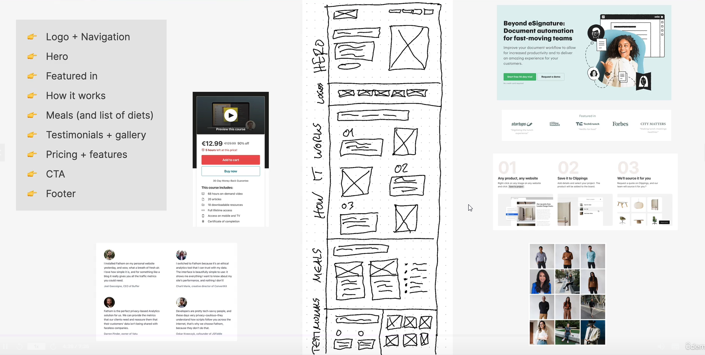

# Project Overview

## Step 1 - Define the project

### Define WHO the website is for:

- For a client

### Define WHAT the website is for:

- Business goal: Selling monthly food subscription
- User goal: Eating well effortlessly, without spending a lot of time and money

### Define target audience

- Busy people who like technology, are interested in a healthy dies, and have a well-paying job

---

## Step 2 - Plan the project

✅ Plan gather website content

❌ Plan out the sitemap
-- We will just build a one-page marketing website (oftentimes called a landing page), so no sitemap

✅ Define website personality
-- Based on the tech-centered target audience, as well as the actual product being sold, we will use the startup/upbeat personality. We might add some elements of the calm/peaceful personality, since the product is all about consumer well-being as well

✅ Plan page sections

---

## Step 3 - Plan page sections

- Logo + Navigation
- Hero
- Featured in
- How it works
- Meals + Diets list
- Testimonials + Gallery
- Pricing
- Features
- Call-to-action (CTA)
- Footer

---

## Step 4 - Ideas and sketch

---

s
